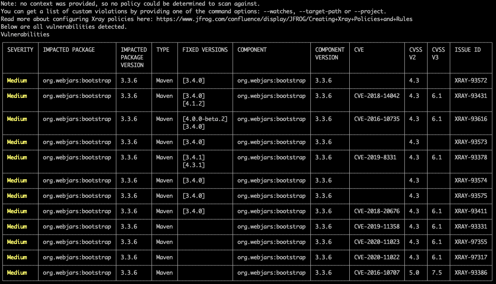

# xray-cli

## Intro

This is a sample project for demonstrating JFrog Xray CLI capabilites of:
* [Dependecies Scanning](https://www.jfrog.com/confluence/display/JFROG/Xray+Dependencies+Scan)
* [On-Demand Binary scanning](https://www.jfrog.com/confluence/display/JFROG/Xray+On-Demand+Binary+Scan)

## Pre-requisties
* [JFrog CLI v2.1.0 (or above)](https://www.jfrog.com/confluence/display/CLI/JFrog+CLI#JFrogCLI-DownloadandInstallationofJFrogCLI)
    * M2_HOME environment variable is needed to be set
    * JFrog CLI configuration should be set with an Access Token
* Artifactory (7.21.3 and above) & Xray (3.29.0 and above) working installation
* Maven - for compiling & packaging the Java sample project ("petclinic")

## Usage

* [Dependecies Scanning CLI](https://www.jfrog.com/confluence/display/CLI/CLI+for+JFrog+Xray#CLIforJFrogXray-AuditingMavenProjects)

    * Vulnerabilites scanning (without Policy or Watch defined)
        ```
        cd spring-petclinic-main/
        jfrog xr audit-mvn
        ```
        Output:
        
    * Violations scanning (based on existing Watch in Xray) in JSON format
        ```
        cd spring-petclinic-main/
        jfrog xr audit-mvn --watches "all-builds" --format json
        ```
        Output:
        

* [On-Demand Binary scanning CLI](https://www.jfrog.com/confluence/display/CLI/CLI+for+JFrog+Xray#CLIforJFrogXray-ScanningFilesontheLocalFileSystemScanningFiles)

    **NOTE:** ```mvn package``` is needed for creating the JAR file under the **target/** directory
    
    * Vulnerabilites scanning (without Policy or Watch defined)
        ```
        cd spring-petclinic-main/target/
        jfrog xr s spring-petclinic-2.4.5.jar
        ```
        Output:
        

    * Violations scanning (based on existing Watch in Xray)
        ```
        cd spring-petclinic-main/target/
        jfrog xr s spring-petclinic-2.4.5.jar --watches "all-builds"
        ```
        Output:
        